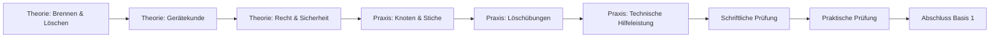

# Einführung & Orientierung

## Was ist die Modulare Truppausbildung (MTA)?

Die **Modulare Truppausbildung (MTA)** ist seit 2014 die standardisierte Grundausbildung für alle Feuerwehrangehörigen in Bayern. Sie ersetzt die frühere Truppmann-Ausbildung und ist **Voraussetzung** für alle weiterführenden Lehrgänge.

### Zweck der MTA

!!! quote "Ziel"
    Die MTA soll dich befähigen, **im Einsatz unter Anleitung** als Truppmann oder Truppfrau zu arbeiten. Du lernst die Grundlagen, um bei Bränden, technischen Hilfeleistungen und anderen Einsätzen sicher und effektiv zu helfen.

### Aufbau der MTA

Die MTA besteht aus **zwei Teilen** (Basis 1 und Basis 2) und umfasst insgesamt **ca. 80-100 Stunden**:

| Modul | Dauer | Inhalt | Prüfung |
|-------|-------|--------|---------|
| **Basis 1** | ca. 80 Stunden | Grundlagen, Theorie & Praxis | Schriftlich + Praktisch |
| **Basis 2** | ca. 20 Stunden (auf 2 Jahre verteilt) | Vertiefung, Übungen im Dienstbetrieb | Keine separate Prüfung |

!!! info "Zeitrahmen"
    - **Basis 1**: Meist als Kompaktlehrgang (2-3 Wochen) oder über mehrere Monate verteilt
    - **Basis 2**: Parallel zum normalen Übungsdienst über 2 Jahre

### Ablauf Basis 1



### Prüfungen

**Schriftliche Prüfung:**

- Multiple-Choice-Fragen
- Dauer: ca. 45-60 Minuten
- Themen: Theorie aus Basis 1

**Praktische Prüfung:**

- Knoten und Stiche
- Gerätehandhabung
- Löscheinsatz oder technische Hilfeleistung
- Arbeiten im Trupp

!!! success "Bestehensgrenze"
    - Schriftlich: mindestens 50% richtig
    - Praktisch: alle Aufgaben müssen sicher beherrscht werden

---

## Organisation der Freiwilligen Feuerwehr in Bayern

### Hierarchie und Struktur

Die Feuerwehr in Bayern ist hierarchisch organisiert:

```
Landesfeuerwehrverband Bayern (LFV)
    ↓
Bezirksfeuerwehrverband (BFV)
    ↓
Kreisfeuerwehrverband (KFV)
    ↓
Freiwillige Feuerwehr Goldkronach
    ↓
Gruppen / Züge
    ↓
Trupps (2 Personen)
```

### Ebenen im Detail

#### 1. Landesebene
- **Landesfeuerwehrverband Bayern (LFV)**
- Vertritt alle Feuerwehren in Bayern
- Erstellt Ausbildungsrichtlinien
- Organisiert Landeswettbewerbe

#### 2. Bezirksebene
- **Bezirksfeuerwehrverband (BFV)**
- Goldkronach gehört zum Bezirk Oberfranken
- Koordiniert größere Einsätze

#### 3. Kreisebene
- **Kreisfeuerwehrverband (KFV)**
- Goldkronach gehört zum Landkreis Bayreuth
- **Kreisbrandrat (KBR)**: oberster Feuerwehrmann im Landkreis
- **Kreisbrandinspektor (KBI)**: Stellvertreter
- Organisiert MTA-Lehrgänge auf Kreisebene

#### 4. Gemeindeebene
- **Freiwillige Feuerwehr Goldkronach**
- Eigenständige Organisation
- Zuständig für Einsätze im Gemeindegebiet

### Rollen in der Feuerwehr

#### Kommandant
- **Leiter der Feuerwehr** vor Ort
- Verantwortlich für Ausbildung, Einsätze, Organisation
- Wird von den Mitgliedern gewählt

**Beispiel:** Der Kommandant plant den Übungsplan, bestellt neue Geräte und führt große Einsätze.

#### Stellvertretender Kommandant
- Unterstützt den Kommandant
- Vertritt ihn bei Abwesenheit

#### Gruppenführer
- Leitet eine Gruppe (9 Personen: 1 Gruppenführer + 2 Trupps à 4 Personen)
- Kommandiert im Einsatz die Gruppe

**Beispiel:** Bei einem Wohnungsbrand teilt der Gruppenführer die Aufgaben ein: „Angriffstrupp zur Menschenrettung vor, Wassertrupp Wasserversorgung sicherstellen!"

#### Truppführer
- Leitet einen Trupp (2 Personen)
- Arbeitet eigenverantwortlich an Teilaufgaben

**Beispiel:** Der Truppführer des Angriffstrupps führt seinen Truppmann ins brennende Gebäude.

#### Truppmann / Truppfrau
- Unterstützt den Truppführer
- Führt Anweisungen aus
- **Das bist du nach der MTA!**

**Beispiel:** Der Truppmann trägt das Strahlrohr, während der Truppführer die Richtung vorgibt.

### Funktionen im Einsatz

#### Grundstruktur: Der Trupp
Ein **Trupp** besteht immer aus **2 Personen**:
- **Truppführer** (erfahrener)
- **Truppmann** (weniger erfahren)

!!! warning "Niemals allein!"
    In der Feuerwehr arbeitet man **niemals allein**. Der Trupp ist die kleinste Einheit und sichert sich gegenseitig ab.

#### Die Gruppe (9 Personen)

Eine **Gruppe** besteht aus:
1. **Gruppenführer** (1)
2. **Angriffstrupp** (2): Geht direkt ins Feuer / zur Einsatzstelle
3. **Wassertrupp** (2): Sichert Löschwasserversorgung
4. **Schlauchmaterialtrupp** (2): Legt Schläuche, unterstützt
5. **Melder** (1): Verbindung zur Leitstelle
6. **Maschinist** (1): Bedient das Fahrzeug (Pumpe, Aggregate)

**Beispiel Einsatz Wohnungsbrand:**
```
Gruppenführer: "Angriffstrupp zur Menschenrettung vor!"
Angriffstrupp: Geht mit Atemschutz und C-Rohr ins Haus

Gruppenführer: "Wassertrupp Wasserversorgung vom Hydranten!"
Wassertrupp: Legt B-Schläuche vom Hydranten zum Fahrzeug

Gruppenführer: "Schlauchmaterialtrupp unterstützt Angriffstrupp!"
Schlauchmaterialtrupp: Legt weitere Schläuche, bringt Material nach
```

---

## Typischer Ablauf der Ausbildung

### Phase 1: Theoretische Grundlagen (ca. 30-40 Stunden)

- Rechtsgrundlagen (FwG, UVV)
- Brennen und Löschen
- Fahrzeugkunde
- Gerätekunde
- Gefahren an der Einsatzstelle
- Verhalten im Einsatz

**Lernmethoden:**

- Präsentationen
- Videos
- Gruppenarbeiten
- Diskussionen

### Phase 2: Praktische Ausbildung (ca. 40-50 Stunden)

- Knoten und Stiche
- Leitern
- Schläuche kuppeln und verlegen
- Löschübungen (mit Wasser, ggf. mit Feuer)
- Technische Hilfeleistung (Absichern, Retten, Heben)
- Atemschutz-Gewöhnung
- Funk

**Lernmethoden:**

- Stationsausbildung
- Übungen in Kleingruppen
- Reale Szenarien
- Wiederholung, Wiederholung, Wiederholung

### Phase 3: Prüfungsvorbereitung

- Zusammenfassung der Theorie
- Wiederholung Knoten
- Probeprüfungen

### Phase 4: Prüfung

- Schriftlich (Multiple Choice)
- Praktisch (Stationen)

### Phase 5: Basis 2 (über 2 Jahre)

- Teilnahme am regulären Übungsdienst
- Vertiefung der Kenntnisse
- Einsatznachbesprechungen
- Spezialisierungen (z. B. Atemschutz, Maschinist)

---

## Unterschied Theorie ↔ Praxis

### Theorie

**Ziel:** Verstehen, **warum** wir etwas tun

**Inhalte:**

- Wie funktioniert Verbrennung?
- Welche Löschmittel gibt es?
- Welche Gesetze regeln die Feuerwehr?
- Wie funktioniert ein Feuerlöscher?

**Lernort:** Klassenzimmer, Schulungsraum

**Prüfung:** Schriftlicher Test

!!! tip "Lerntipp"
    Theorie ist die Basis für sicheres Handeln im Einsatz. Wer versteht, warum etwas gemacht wird, macht es richtig.

### Praxis

**Ziel:** Können, **wie** wir etwas tun

**Inhalte:**

- Knoten binden
- Schläuche kuppeln
- Leitern aufstellen
- Löschübungen durchführen

**Lernort:** Feuerwehrhaus, Übungsgelände, Straße

**Prüfung:** Praktische Stationen

!!! tip "Übungstipp"
    Praxis braucht Wiederholung! Knoten, die du 100-mal gemacht hast, kannst du auch unter Stress.

---

## Beförderungen & Dienstgrade

Nach der MTA kannst du dich weiterbilden und aufsteigen:

| Dienstgrad | Voraussetzung | Funktion |
|------------|---------------|----------|
| **Feuerwehrmann-Anwärter** | Eintritt in die Feuerwehr | - |
| **Feuerwehrmann** | MTA Basis 1 abgeschlossen | Truppmann |
| **Oberfeuerwehrmann** | 3 Jahre aktiv + Basis 2 | Truppmann |
| **Hauptfeuerwehrmann** | 6 Jahre aktiv | Truppmann/Truppführer |
| **Löschmeister** | Truppführerlehrgang | Truppführer |
| **Oberlöschmeister** | Gruppenführerlehrgang | Truppführer |
| **Hauptlöschmeister** | Gruppenführerlehrgang | Gruppenführer |
| **Brandmeister** | Weitere Lehrgänge | Gruppenführer |
| **Oberbrandmeister** | Zugführerlehrgang | Zugführer |
| **Hauptbrandmeister** | Führungslehrgänge | Zugführer |
| **Kommandant** | Wahl durch die Mannschaft | Leiter der Feuerwehr |

!!! info "Wichtig"
    Dienstgrade sind **keine Ränge wie beim Militär**, sondern zeigen Erfahrung und Ausbildung. Respekt verdient man sich durch Können, nicht durch Schulterklappen.

---

## Wichtige Prinzipien der Feuerwehr

### 1. Sicherheit geht vor

!!! danger "Oberste Regel"
    **Eigenschutz vor Fremdschutz!** Du kannst niemandem helfen, wenn du selbst verletzt bist.

### 2. Kameradschaft

Die Feuerwehr funktioniert nur, wenn alle zusammenarbeiten und sich gegenseitig helfen.

### 3. Freiwilligkeit

In Bayern sind die meisten Feuerwehren freiwillig. Das bedeutet: Du machst das ehrenamtlich, in deiner Freizeit – aus Überzeugung.

### 4. Politische & religiöse Neutralität

Die Feuerwehr hilft **allen Menschen**, unabhängig von Herkunft, Religion oder politischer Einstellung.

---

## Erwartungen an dich

### Während der MTA

- **Pünktlichkeit**: Sei immer 10 Minuten früher da
- **Mitarbeit**: Stelle Fragen, mach mit, lerne aktiv
- **Respekt**: Gegenüber Ausbildern und Kameraden
- **Eigeninitiative**: Übe zuhause (Knoten!), lies nach

### Nach der MTA

- **Übungsdienst**: Nimm regelmäßig teil (1-2x pro Monat)
- **Einsätze**: Rücke aus, wenn du alarmiert wirst
- **Weiterbildung**: Besuche weitere Lehrgänge
- **Kameradschaft**: Engagiere dich, hilf mit, pflege das Gemeinschaftsleben

---

## Nächste Schritte

Jetzt weißt du, was die MTA ist und wie die Feuerwehr organisiert ist. Weiter geht's mit:

1. [Begriffe & Abkürzungen](begriffe.md) – damit du die Feuerwehrsprache verstehst
2. [Theorie: Ziele & Aufgaben](theorie/ziele-aufgaben.md) – die Grundlagen der Feuerwehr
